<style>
em {
  font-style: italic
}
strong {
  font-weight: bold;
}
pre {
  margin-top: -5px;
  margin-bottom: -5px;
}

}
img.center {
    display: block;
    margin-left: auto;
    margin-right: auto;
}
</style>

## Outline
- Overview of Version Control
- Basics of Git
- Establishing 'Best Practices'

---
## Overview of Version Control

---
## What is a Version Control System
- VC allows you to track the history of a collection of files 
- Offers functionality to revert collection of files to another version (future/previous)
- Each version is a **Snapshot** of the files at a certain time
- The collection of files and their complete history is called a **repository**
- Any type of file can be version controlled

---
## Repository Visualization

**needs image**


---
## Git
- Git is one of many possible version control systems 
- A distinguishing feature is it uses a **distributed version control** architecture
- A user can **clone** (copy) a full existing repository
- Each clone contains the full history of the collection of files and all functionality
- The repositories can exchange versions of the files with other repositories

---
## Remote Repositories
- To make it easier to manage the history of a project - a remote server is often as a central repository
- This is only for convenience - it is not 'special' compared to any other clone
- It does make it easy for multiple people to work from, and sync to, an updated copy
- Users can both **pull** changes from the remote repository to their computer
- as well as **push** changes from their computer to the remote repository

---
## Repository Visualization

#**need image**


---
## How Git Works
Git has **3** main states for a file:
- modified
- staged
- committed 

Likewise, there are 3 main sections to any git project:
- working directory
- staging area
- git directory (repository)

--- 
## Git Workflow

*** {name:left}
**needs image** like Fig 1-6

*** {name:right}
1. modify files in working directory
2. Stage a file (add a snapshot to staging area)
3. Commit the staged snapshot to the git direcoty
*4.* (optional): push changes to remote repository

--- 
## Let's go hands-on


---
## Initial setup
- We are going to learn git (mostly) from the Rstudio IDE to start - it makes it easy to start projects and has a 'point-and-click' element that takes some of the learning curve away

---
## Setting your identity
- The first time on a computer you must set your user-name and email address
- This information is included in your commits

```
git config --global user.name "<your name>"
git config --global user.email <emailaddress>
```

ex:

```
git config --global user.name "Devin Pastoor"
git config --global user.email devin.pastoor@umaryland.edu
```

---
## Checking Your Settings

You can check your settings easily by trying

```
git config --list
```

Or a specific key value is by doing

```
git config <key>
```

ie `git git config user.name`

---
## Getting Help

You can get help by typing
```
git help <verb>
```

for example, to get help about the config command:
```
git help config
```

---
## Creating a New Repository
For our purposes, the easiest way to manage a new repository is to initialize an empty repository on bitbucket/github and use that as a blank slate to start your project.

### To start, to to [bitbucket](https://bitbucket.org)

---

## Creating a New Repository (2)
Click on the 'Create' button in the top left

<p style= "text-align:center">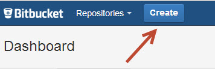 </p>

---
## Name Your Repository
(optionally) can set settings for issue tracking, wiki, and language

<p style= "text-align:center">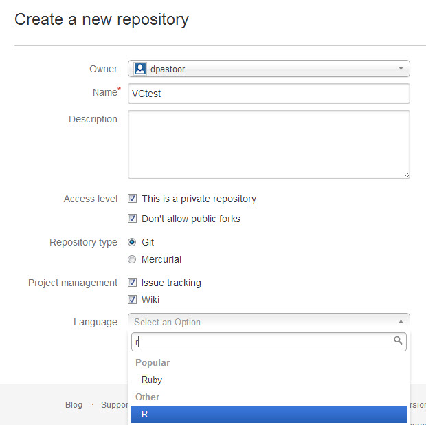 </p>

---
## Repository Set-up
You can easily follow the bitbucket guide to set up your repository from scratch

<p style= "text-align:center">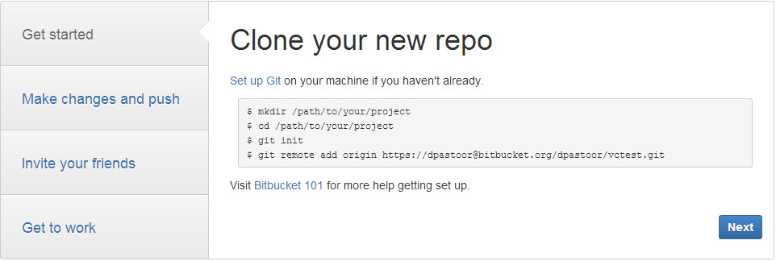 </p>

---
## Repository Set-up from R-Studio
But we're going to do it from R-studio
1. Click on the 'Clone' button while in the repository on bitbucket.
  - You only want to highlight the https portion (stuff after the 'git clone')

<p style= "text-align:center">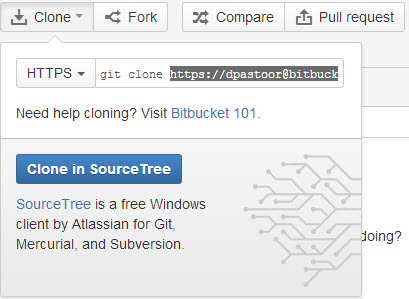 </p>

---
## Repository Set-up from R-Studio (2)
2. Create a new R-project

<p style= "text-align:center">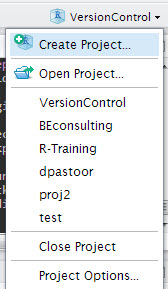 </p>

--- 
## Repository Set-up from R-Studio (3)
3. Choose 'Create Project From: Version Control'

<p style= "text-align:center">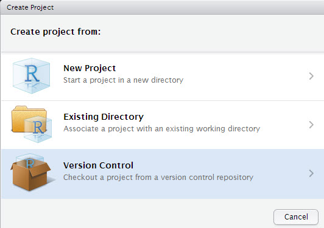 </p>

--- 
## Repository Set-up from R-Studio (4)
4. Choose 'Git'

<p style= "text-align:center">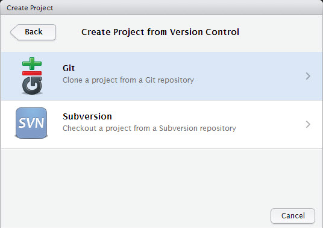 </p>

--- 
## Repository Set-up from R-Studio (5)
5. Paste link copied from bitbucket in 'Repository URL' and create project

<p style= "text-align:center">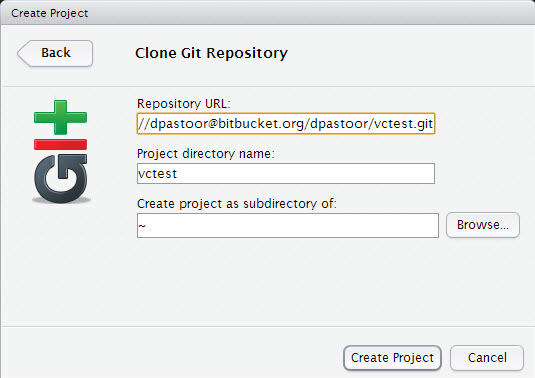 </p>

---
## Repository Set-up from R-Studio (6)
6. Type in BB password when it asks and your repository will be cloned to your computer

<p style= "text-align:center">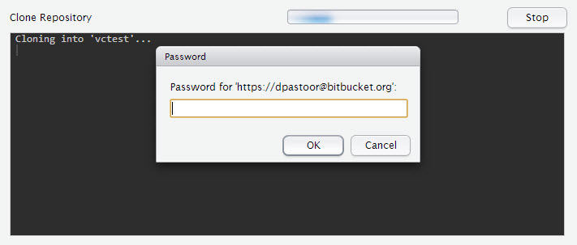 </p>


---
## Our First Commit
Let's add the Rproject file to the repository
1. Go to the 'Git' tab on your workspace tab in Rstudio and click 'Commit'
2. Check anything that you'd like to stage (in this case everything) and type a commit message


<p style= "text-align:center">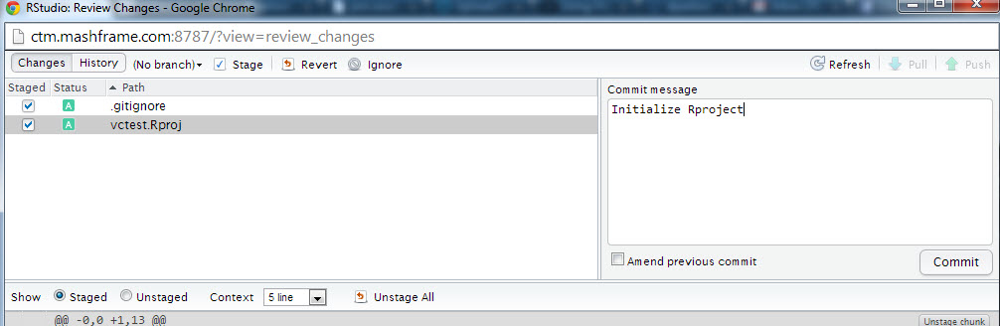 </p>

---
## Our First Commit (2)
The local repository has now been updated! But we want to push that change to the remote repository
3. Choose 'Push' and type in your BB pasword when prompted

<p style= "text-align:center">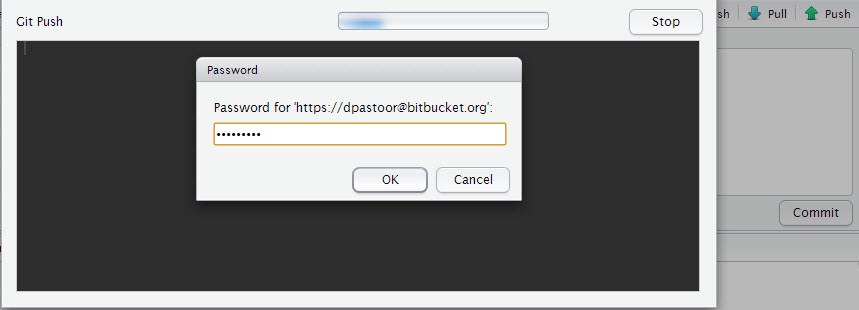 </p>

---
## Check the Remote
We can now go back to bitbucket and see that it has been successfully updated

<p style= "text-align:center">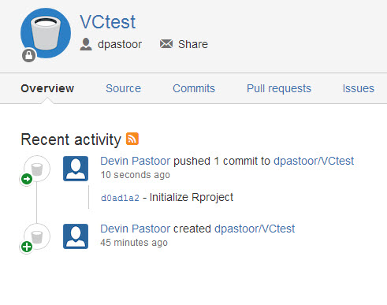 </p>


---
# Version Control 'Best Practices'

